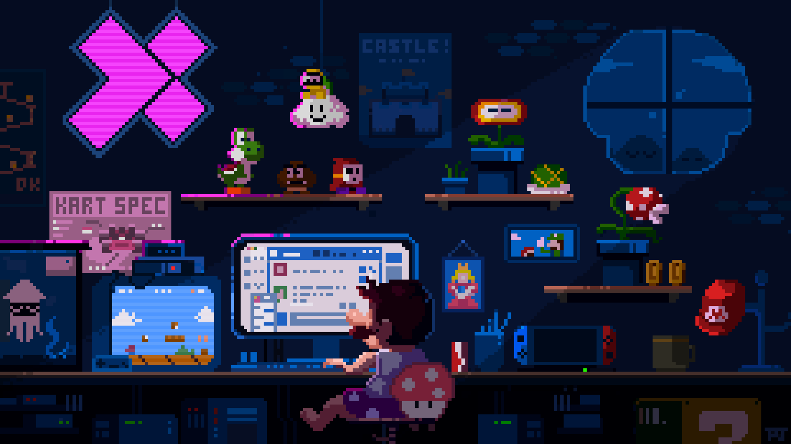

### 👨🏻‍💻 Sobre mim

Sou desenvolvedor full stack, de Guanambi, Bahia. No dia a dia trabalho desde a arquitetura até o deploy em produção de sistemas web, APIs e integrações, cuidando de tudo, desde a definição técnica dos projetos até a sustentação em produção, passando por integrações com sistemas legados e melhorias de performance.

Boa parte desse trabalho acontece em repositórios privados de empresa (Azure DevOps, Bitbucket), então o histórico público aqui no GitHub ainda não reflete tudo que produzo no dia a dia. Pretendo trazer mais projetos e contribuições pra cá também.

Também curso pós-graduação em Engenharia de IA e sou tecnólogo em Análise e Desenvolvimento de Sistemas.

### 🛠️ Stack

### 📫 Contato

Se você tem uma ideia pra tirar do papel, me chama e a gente conversa. Vai ser um prazer construir algo junto! 🚀

